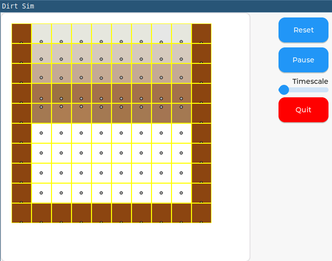

I'm not quite sure what this is but... currently it is a grid-based physics simulation, with the intent to be the background for a-life experiments. Currently there are the beginnings of a tree organism.

The main application is in test-lvgl.

