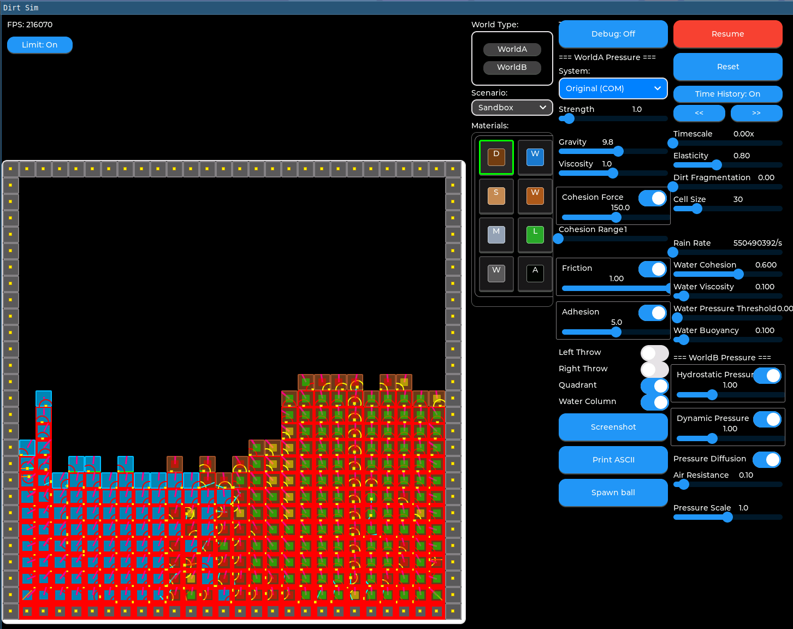

Playground for yocto, zephr, and lvgl.

The main application is in test-lvgl and is currently a WIP cell-based dirt simulation.

For Yocto/Zephr work, enter the venv like so:

    source .venv/bin/activate

(Yocto/Zephr stuff is not yet committed.)

